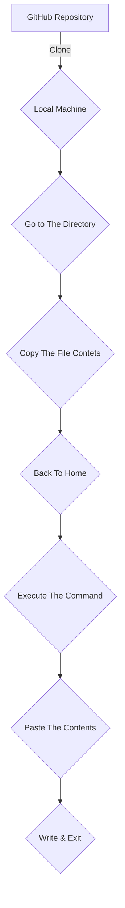

# GDB Dashboard Configuration File
## GDB
GDB stands for GNU Debugger. It is a powerful command-line debugger for various programming languages, primarily used for debugging C, C++, and other related languages. GDB allows developers to inspect and manipulate the state of programs during execution, helping them to identify and fix bugs in their code.
## GDB Dashboard
It is a command line tool for debugging based on GDB. [Click Here](https://github.com/cyrus-and/gdb-dashboard) To Know More.
## Configuring The Config
**`Follow The Steps:`**
 - Clone the [GitHub](https://github.com/emon4075/gdb_dashboard) repository to your local machine.
 - Go to the cloned directory.
 - Copy the contents of the **init** file.
 - Go back to home directory.
 - Now execute the following command:` 

> nvim `.gdbinit.d/init`

 - Now paste the copied contents.
 - Finally save & exit the file.
 ## Now You Are Ready To Rock & Enhance Your Debugging Experience.

